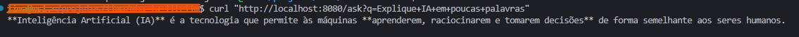
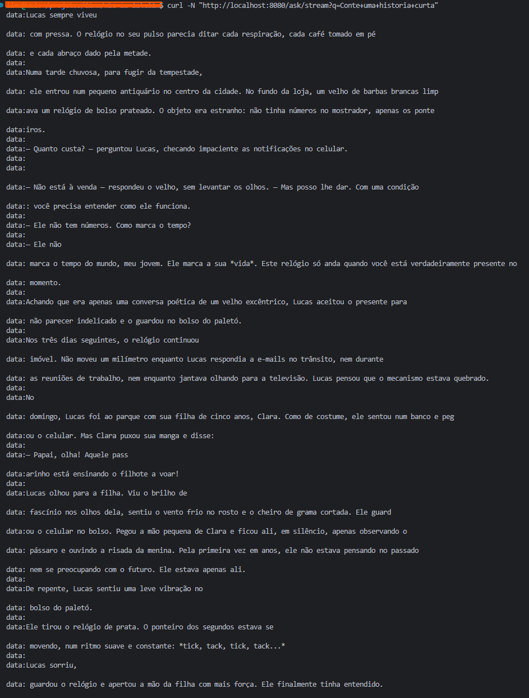
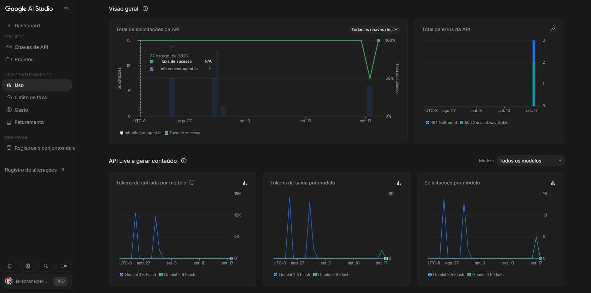

# mba-ia-litellm

Spring Boot 4 + Spring AI 2 consumindo o [LiteLLM Proxy](https://docs.litellm.ai) (gateway OpenAI-compatível) com Gemini por trás.

```
app (8080) ──> litellm (4000) ──> Gemini API
                   └──> db (postgres)
```

## Pré-requisitos

- Docker + Docker Compose v2
- Chave do Gemini (Google AI Studio)

## Configuração

```bash
cp .env.example .env
```

Preencha no `.env`:

| Variável             | Descrição                                   |
|----------------------|---------------------------------------------|
| `GEMINI_API_KEY`     | chave do Google AI Studio                   |
| `LITELLM_MASTER_KEY` | chave de admin do proxy (usada pela app)    |
| `LITELLM_SALT_KEY`   | salt para criptografia de chaves no banco   |

O modelo exposto pelo proxy está em `litellm_config.yaml` (alias `gemini-flash` → `gemini/gemini-3.6-flash`).

## Subir

```bash
docker compose up -d --build        # primeira vez / após mudar código
docker compose up -d                # próximas vezes
```

Subir só a infra e rodar a app localmente:

```bash
docker compose up -d litellm
./gradlew bootRun
```

## Logs

```bash
docker compose logs -f              # todos
docker compose logs -f app
docker compose logs -f litellm
docker compose logs -f db
docker compose ps                   # status / healthchecks
```

## Baixar

```bash
docker compose down                 # para e remove containers
docker compose down -v              # também apaga o volume do Postgres
docker compose restart litellm      # após editar litellm_config.yaml
```

## Endpoints

| Método | Rota                  | Descrição                    |
|--------|-----------------------|------------------------------|
| GET    | `/ask?q=`             | resposta completa            |
| GET    | `/ask/stream?q=`      | resposta em streaming (SSE)  |

## Exemplos

App:

```bash
curl "http://localhost:8080/ask?q=Explique+IA+em+poucas+palavras"
```



```bash
curl -N "http://localhost:8080/ask/stream?q=Conte+uma+historia+curta"
```



Proxy direto (OpenAI-compatível):

```bash
curl http://localhost:4000/v1/chat/completions \
  -H "Authorization: Bearer sk-1234" \
  -H "Content-Type: application/json" \
  -d '{"model":"gemini-flash","messages":[{"role":"user","content":"oi"}]}'

curl http://localhost:4000/v1/models -H "Authorization: Bearer sk-1234"

curl http://localhost:4000/health/liveliness
```

UI de administração do LiteLLM: http://localhost:4000/ui (login com `LITELLM_MASTER_KEY`).

## Uso no Google AI Studio

Consumo dos tokens e requisições por modelo após as chamadas via proxy:


